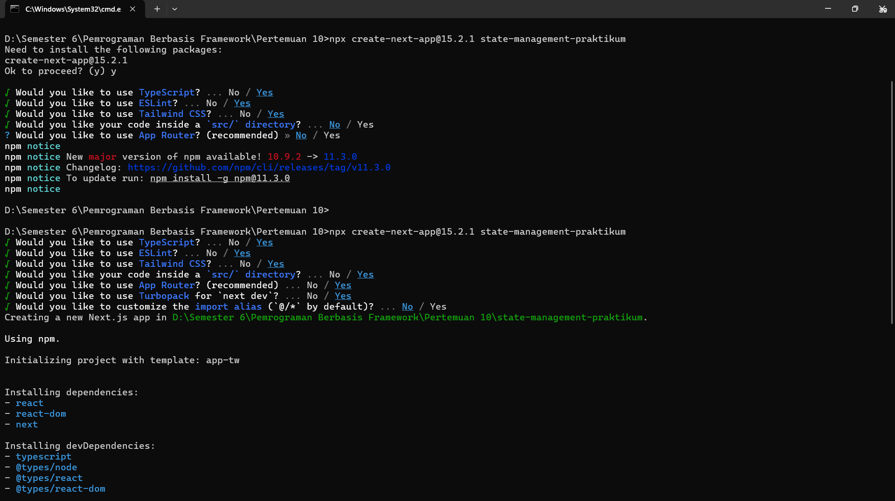
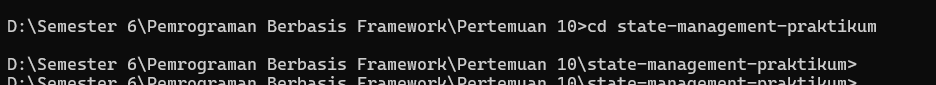
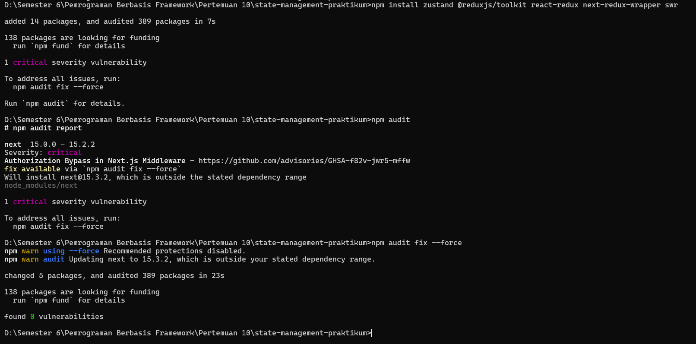

# Rio Bagas Hermawan
# 2241720193
# TI-3D

### Praktikum
1.	Buat proyek baru:
npx create-next-app@15.2.1 state-management-praktikum

cd state-management-praktikum

2.	Install dependensi tambahan:
npm install zustand @reduxjs/toolkit react-redux next-redux-wrapper swr

### Praktikum 1: React Context untuk State Global Sederhana
Langkah 1: Buat Context

 
Langkah 2: Implementasi di Komponen

 
Langkah 3: Wrap Aplikasi

 

 

### Praktikum 2: Zustand untuk State Management Kompleks
Langkah 1: Buat Store
 
Langkah 2: Implementasi Komponen
 
Langkah 3: Gunakan Komponen dalam halaman
 
 
Praktikum 3: Redux Toolkit dengan SSR Support
Langkah 1: Setup Redux
 
Langkah 2: Buat Slice
 

Langkah 3: Provider Setup
 
Langkah 4: Implementasi Komponen
 
Langkah 5: Gunakan Komponen dalam halaman
 
 
Praktikum 4: Data Fetching dengan SWR
Langkah 1: Implementasi Data Fetching
 
Langkah 2: Gunakan Komponen dalam halaman
 
 
Praktikum 5: URL State Management
Langkah 1: Implementasi URL State
 
Langkah 2: Gunakan Komponen dalam halaman
 
 
Tugas
1.	Bandingkan performa antara Context API, Zustand, dan Redux
2.	Diskusikan kapan sebaiknya menggunakan masing-masing solusi
