# Rio Bagas Hermawan
# 2241720193
# TI-3D

### Praktikum
1.	Buat proyek baru:
npx create-next-app@15.2.1 state-management-praktikum
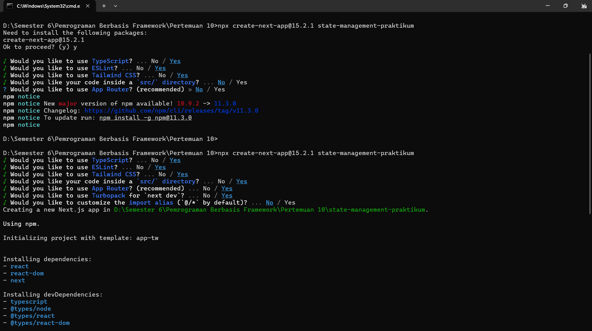
cd state-management-praktikum
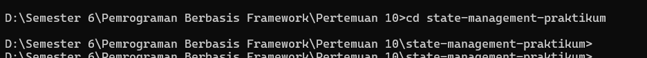

2.	Install dependensi tambahan:
npm install zustand @reduxjs/toolkit react-redux next-redux-wrapper swr
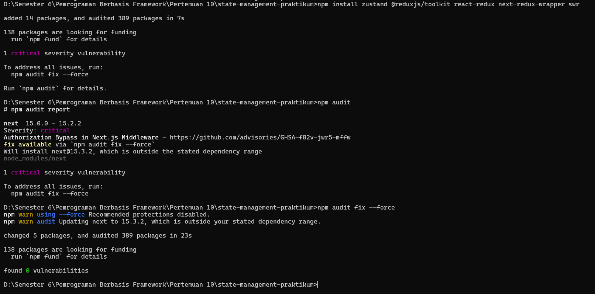

### Praktikum 1: React Context untuk State Global Sederhana
1. Langkah 1: Buat Context
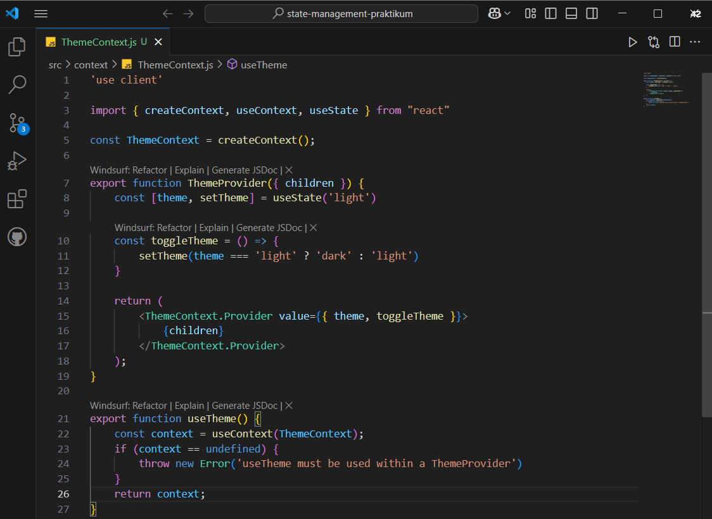
 
2. Langkah 2: Implementasi di Komponen
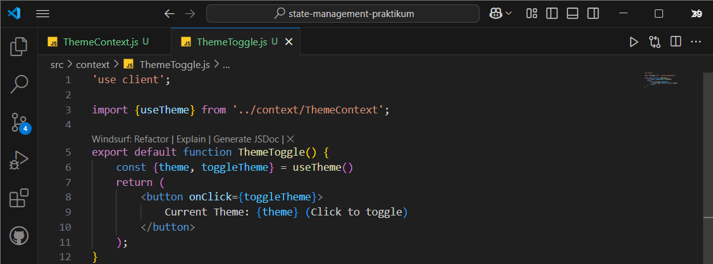
 
3. Langkah 3: Wrap Aplikasi
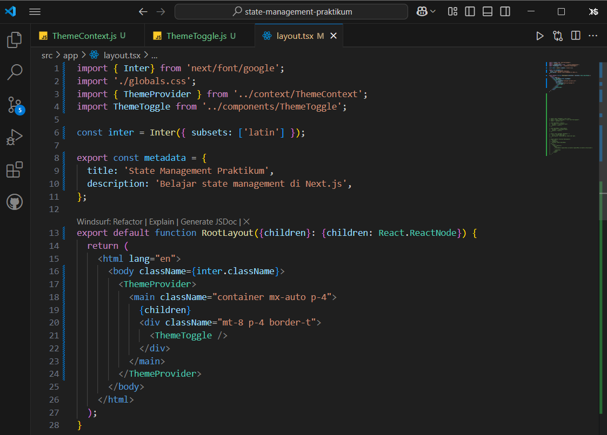
Hasil Output localhost
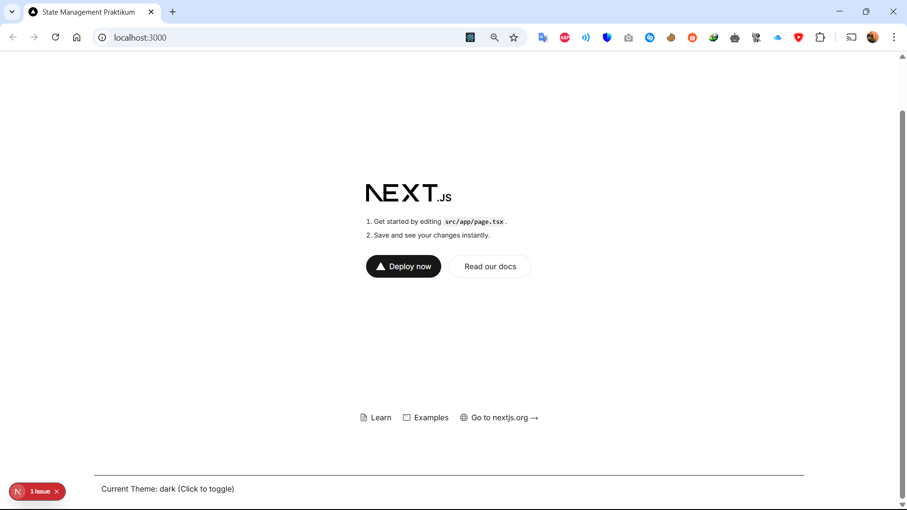
 

 

### Praktikum 2: Zustand untuk State Management Kompleks
1. Langkah 1: Buat Store
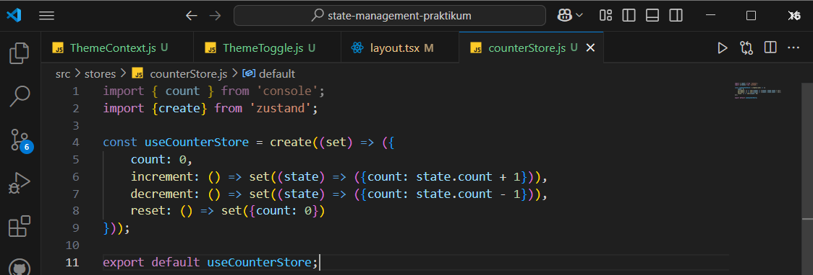
 
2. Langkah 2: Implementasi Komponen
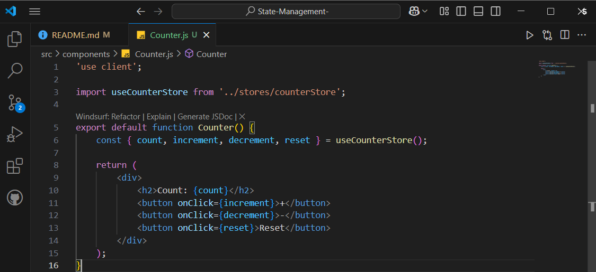
 
3. Langkah 3: Gunakan Komponen dalam halaman
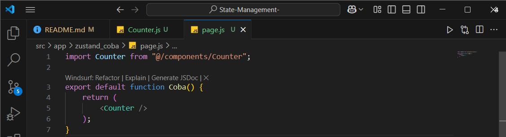
Hasil Output localhost
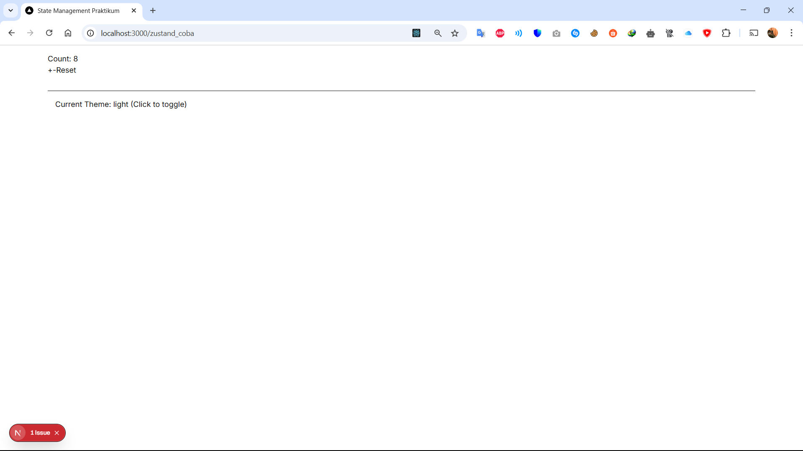
 
 
### Praktikum 3: Redux Toolkit dengan SSR Support
1. Langkah 1: Setup Redux
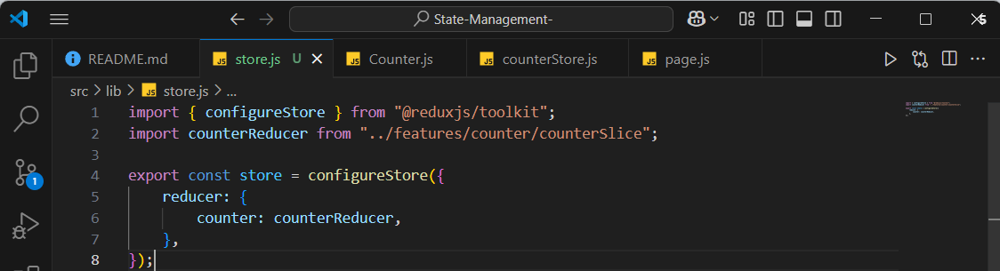
 
2. Langkah 2: Buat Slice
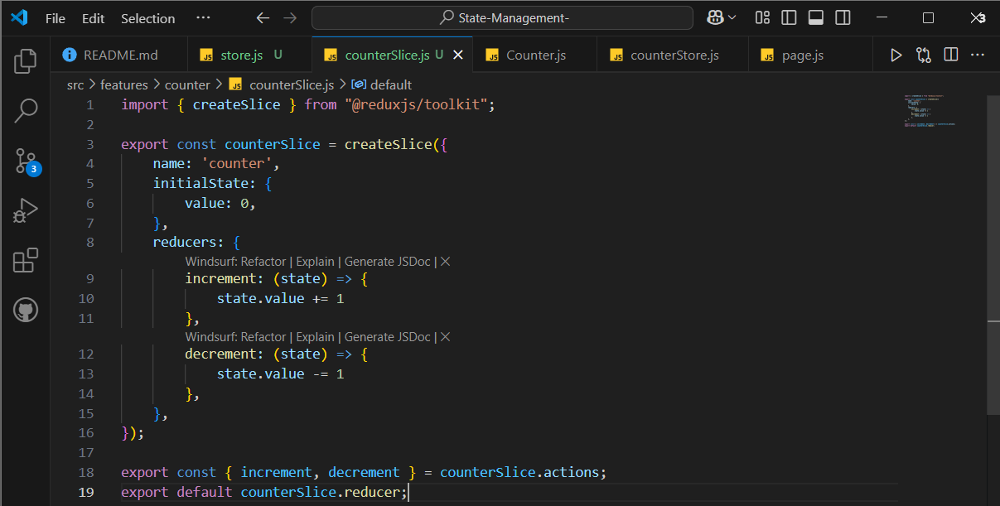

3. Langkah 3: Provider Setup
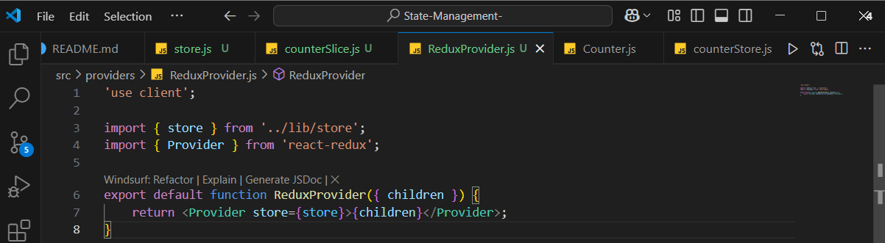

4. Langkah 4: Implementasi Komponen

5. Langkah 5: Gunakan Komponen dalam halaman
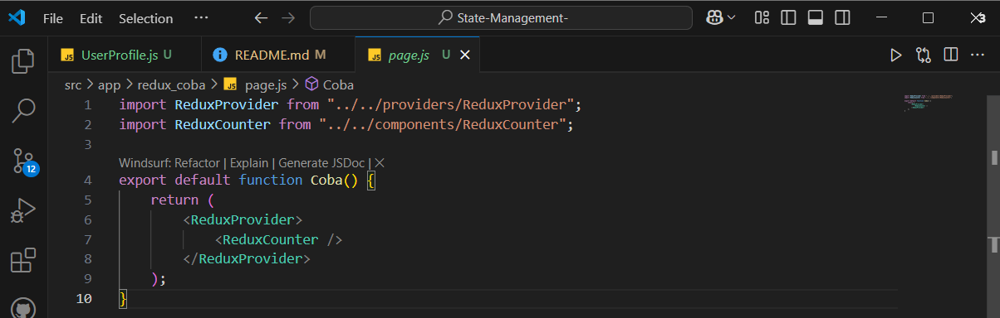
Hasil Output localhost
 
 
### Praktikum 4: Data Fetching dengan SWR
1. Langkah 1: Implementasi Data Fetching
 
2. Langkah 2: Gunakan Komponen dalam halaman
 
 
### Praktikum 5: URL State Management
1. Langkah 1: Implementasi URL State
 
2. Langkah 2: Gunakan Komponen dalam halaman
 
 
### Tugas
1.	Bandingkan performa antara Context API, Zustand, dan Redux
2.	Diskusikan kapan sebaiknya menggunakan masing-masing solusi
